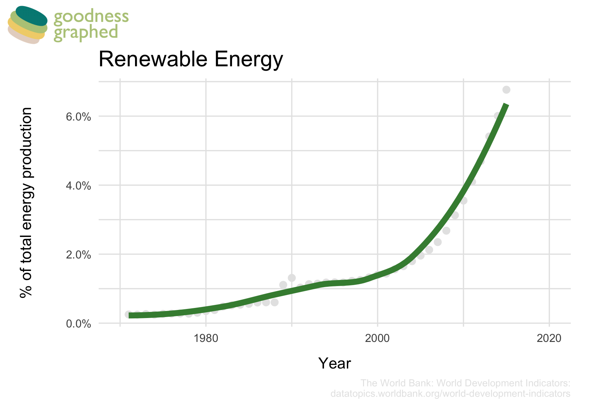
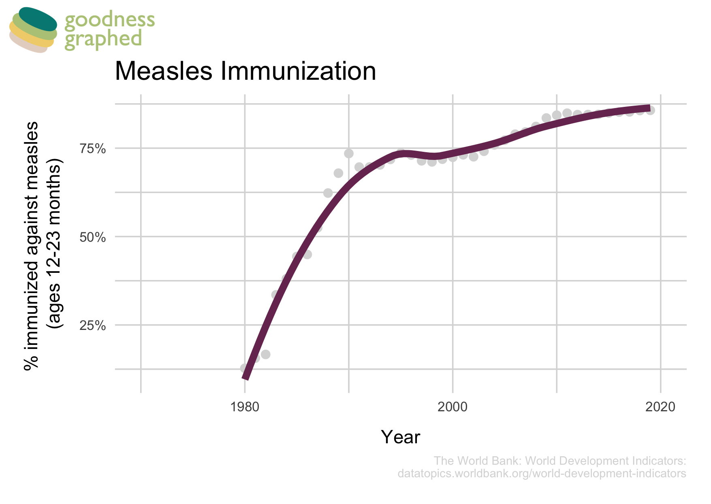
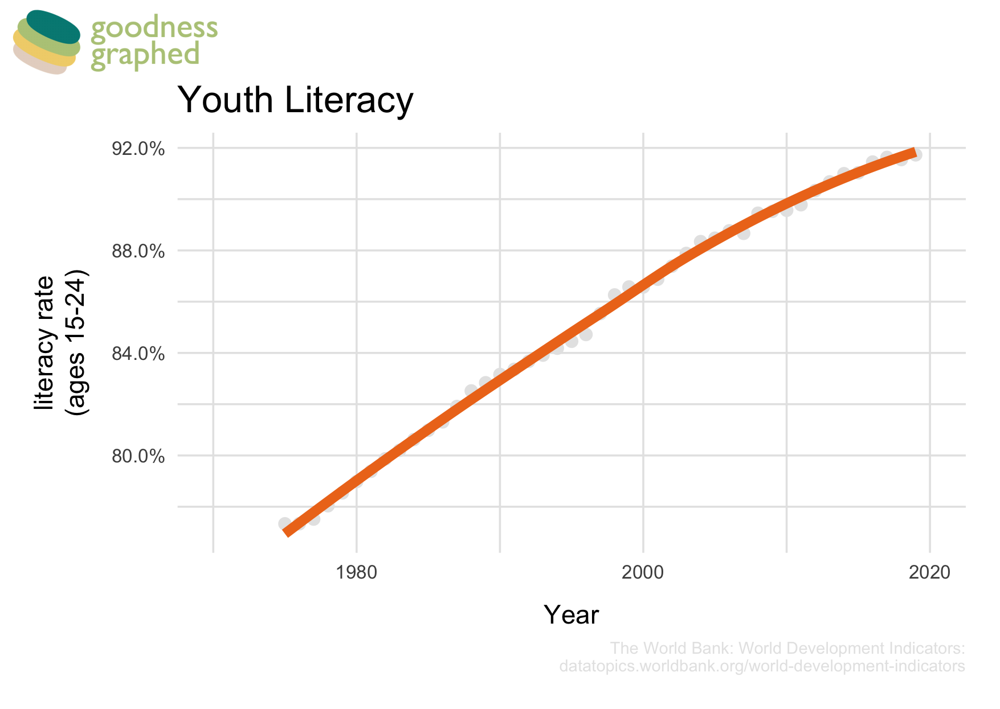
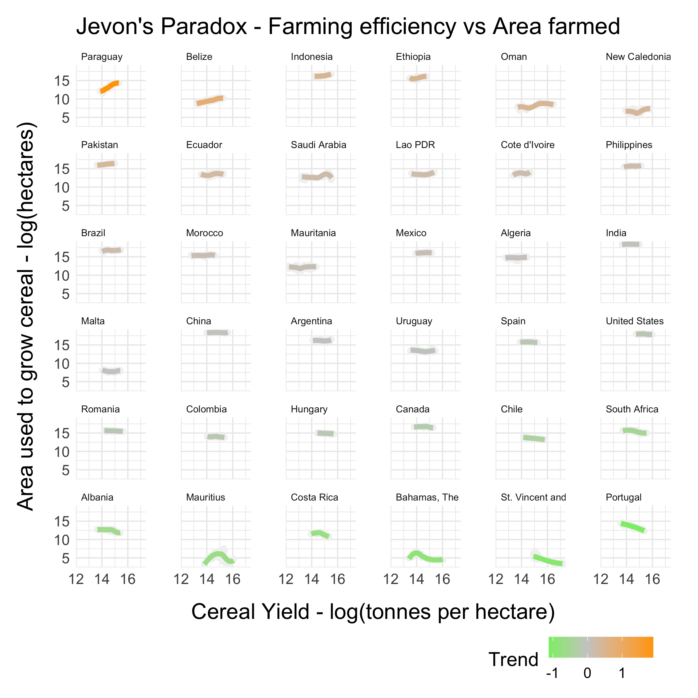

# Goodness Graphed

*A small set of "good news" charts — the slow, quiet trends that are actually going
right, pulled straight from World Bank data and drawn to be printed and put on a wall.*

The news optimises for alarm. But a lot of the most important things in the world are
getting steadily, boringly better — and that almost never makes a headline, because
"slightly better than last year, again" isn't a story. I wanted the opposite of
doomscrolling: a few honest charts that give you *a fine feeling*.

So I pulled the [World Bank's World Development Indicators](https://datatopics.worldbank.org/world-development-indicators/),
picked trends that are quietly heading the right way, and drew each one as a clean
single-line chart in R / ggplot2 — big title, muted gridlines, the raw points behind a
smoothed trend, and the source printed in the corner so it's checkable.

The renewable-energy share of global production sits flat for decades, then bends into a
near-exponential climb after 2000. Same shape, different topic, each chart:

| | |
|---|---|
|  |  |

There's also a [Jevons paradox](https://en.wikipedia.org/wiki/Jevons_paradox) piece —
the uncomfortable counter-note that efficiency gains can *raise* total consumption — so
the set isn't pure cheerleading; it's "here's the trend, here's the source, decide for
yourself."

## How it's built

- **Data** — World Bank WDI bulk CSV, filtered to one indicator per chart.
- **Charts** — R + ggplot2, a shared theme/`graph_functions.R` so every chart in the
  set looks like part of one family.
- **Branding** — a little "Goodness Graphed" stacked-globe logo, and each poster carries
  a **QR code** generated in R that links back to the source dataset, so a printed copy
  on a noticeboard is still traceable to the data.
- **Output** — exported as SVG and PNG at print resolution, laid out against a
  print-and-copy price guide so they could actually be run off and pinned up.

It's a 2021 project and the data ends there, but the point isn't the exact numbers — it's
the habit: when everything feels like it's on fire, go find the long line and look at
where it's actually pointing.
