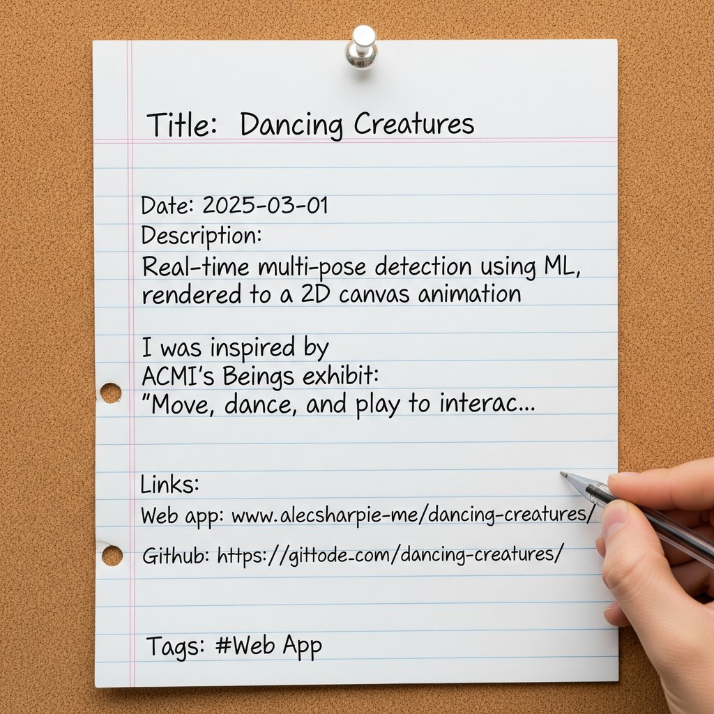

# Notice-Board Portfolio

*An AI-generated, OCR-checked version of this very portfolio — every project as a sheet
of paper pinned to a cork board.*

I wanted a playful alternative to the usual grid of project cards: what if each project
were a handwritten note pinned to a notice board? The catch is that image models are
famously bad at text — ask for a paragraph and you get convincing-looking gibberish.

So I made it a closed loop. For each project I feed the real title, date and
description to Google's Imagen and ask for a photo of lined notebook paper pinned to
cork, with that text written on it. Then I run the result through OCR (Tesseract) and
score how close the read-back text is to the original. If it's off, it retries with a
tweaked prompt — up to ten attempts — and keeps the best one.

The honest result: text-in-images is *hard*. Plenty of runs top out around 60–90%
similarity, with charming artifacts — `github.com` becomes `gittode.com`, a date
drifts. But when it lands you get a genuinely lovely hand-made-looking page, generated
end to end straight from `projects.json`.

It's the same shape as my [Screenshot Backpressure](../screenshot-backpressure/README.md)
experiment, from the other direction: generate something, have a machine *read it back*,
and retry until reality matches intent.

## The pieces

- **`projects.json`** — the source text for every board
- **Google Imagen** — generates the notice-board photo (text and all)
- **Tesseract OCR** — reads the generated text back out
- **a similarity score + retry loop** — regenerate until the text is legible enough
- **output** — full-res PNGs + compressed JPEGs, ready to drop into the site

Built Aug–Sep 2025, on Imagen 3 then Imagen 4.
