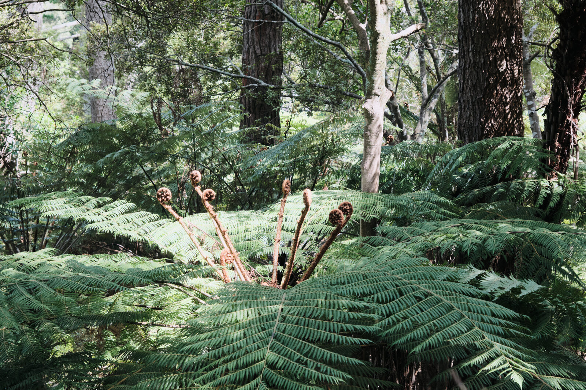
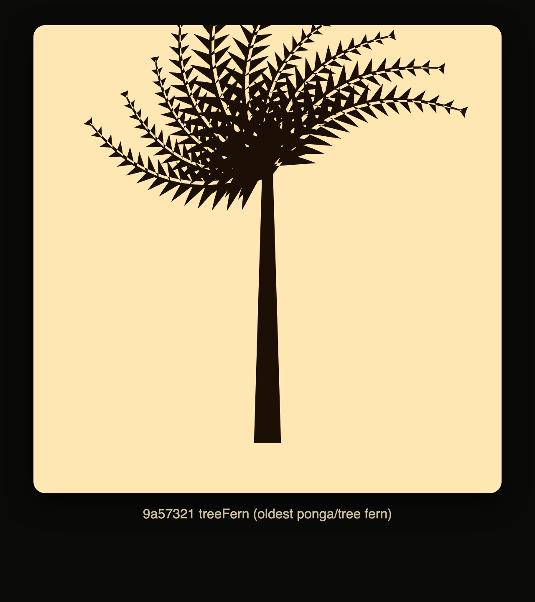
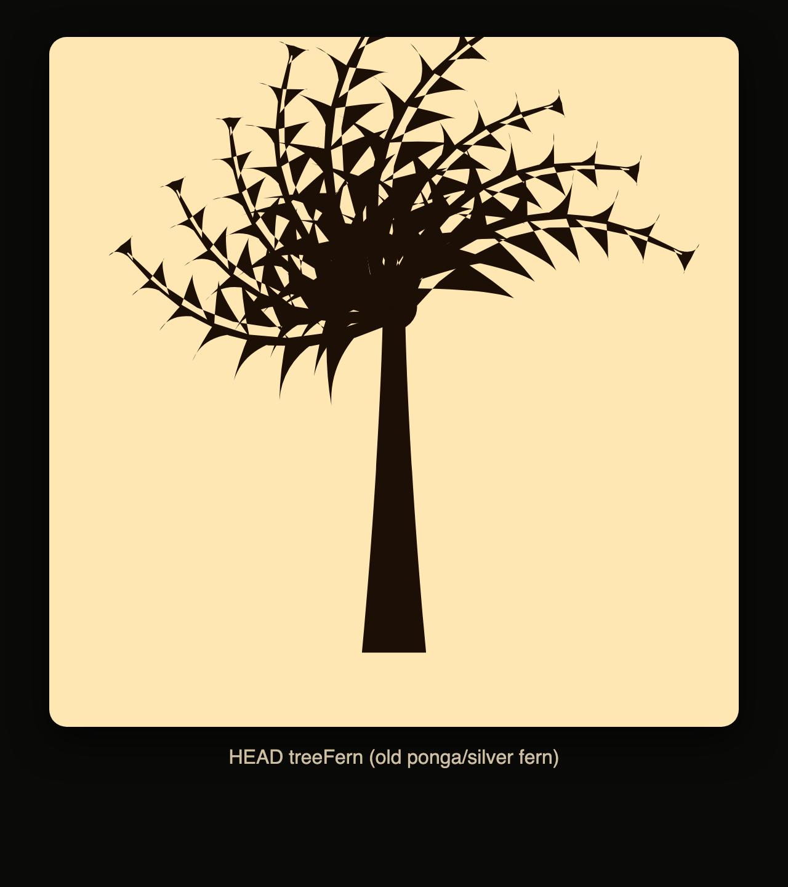
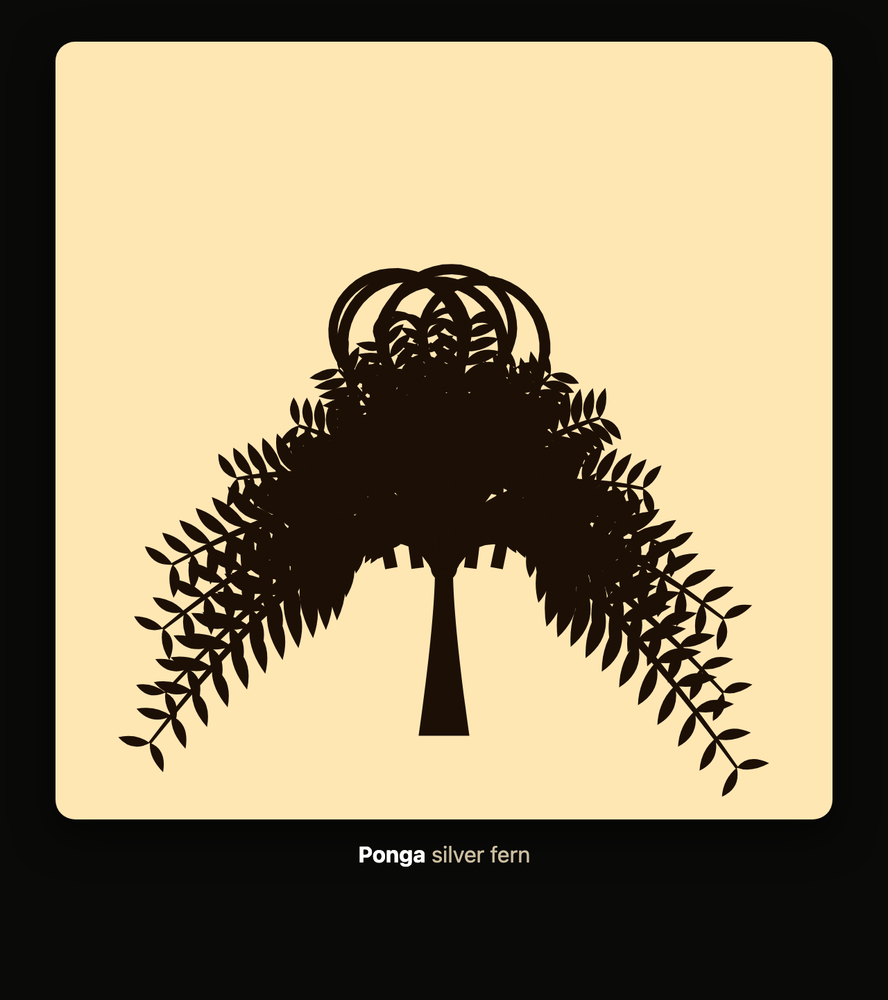
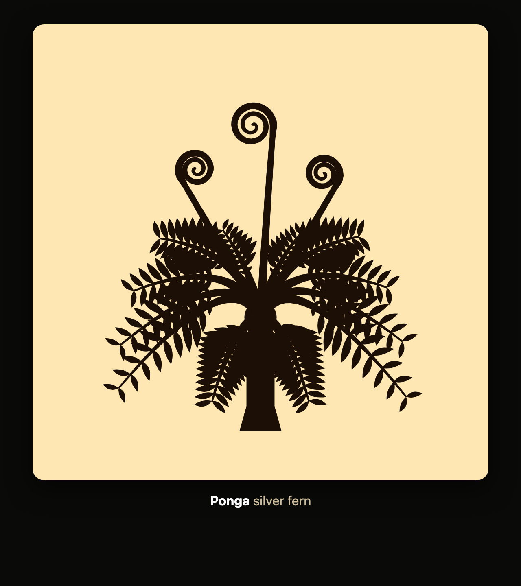
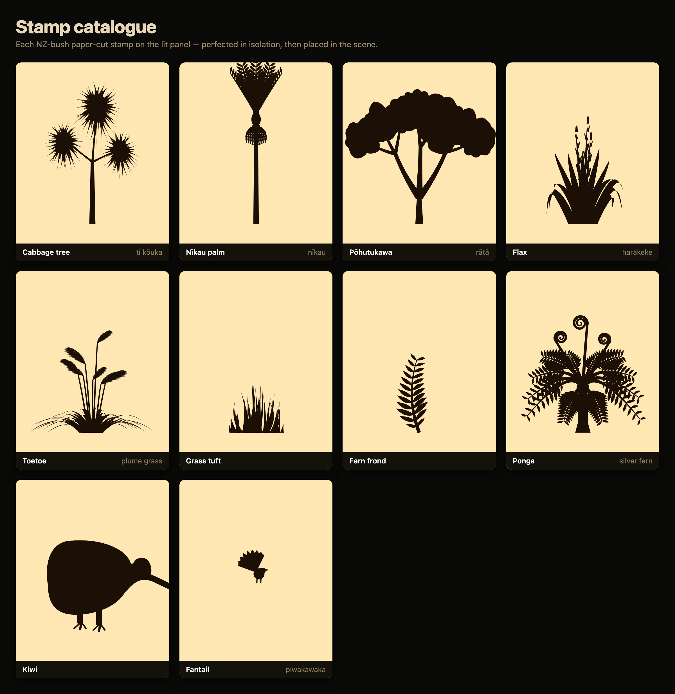

# Screenshot Backpressure

*Giving a coding agent eyes, so a reference photo can push back on the code it writes.*

Ask an AI to write *visual* code — SVG, canvas, CSS — and it's working blind. It emits
some plausible path data, you render it, and half the time it looks nothing like what
you asked for. The agent never sees the gap, so it never closes it.

The fix is almost embarrassingly simple: after every edit, render the code, screenshot
it, and hand the picture straight back to the agent's vision — with a target reference
photo sitting next to it. Now it can *see* that the fern's koru are too big, that the
trunk doesn't meet the leaves, that the outer fronds are poking out as bare spikes. So
it fixes them, and you loop until the render matches the photo.

I'm calling it **backpressure** after the streaming idea, where a slow consumer pushes
back on an over-eager producer to keep it in sync with reality. Here "reality" is the
rendered pixels, and each screenshot is a unit of pressure throttling the agent's
confident hallucination.

## The example: a ponga from code

I built this while turning photos of NZ-bush plants into deterministic paper-cut SVGs —
each plant a single seeded function. The ponga (silver tree fern) is a good case. The
target is just a photo dropped in a folder:

Dug out of git history, the code's idea of a silver fern started **rough** and got
walked to a clean cut purely by looking at each render next to that photo:

| v0 — earliest | v1 — fishbone | v2 — tangled koru | v3 — final |
|---|---|---|---|
|  |  |  |  |
| a stick with a one-sided spray of spikes | thin, scraggly, no real form | a vase crown, but a blob with giant koru | weeping crown, tight koru, squared trunk |

Every step in between was one screenshot and one note — *"koru too big"*, *"trunk
doesn't meet the leaves"*, *"move the back two leaves to the front"*. None of those are
things the agent could have known were wrong without seeing the output.

The whole set got the same treatment:

## Why it works

- **It closes the perception gap** — an LLM can't see pixels unless you show them.
- **A real reference keeps it honest** — comparing to a photo beats drifting on vibes.
- **Render-and-shoot takes seconds** — many small *verified* steps beat one big guess.
- **Good division of labour** — I supply taste (*"tighter koru"*, *"bushier"*); the
  agent does the parameter-fiddling and its own QA by looking.
- **Determinism makes it trustworthy** — seeded output means a screenshot is evidence,
  not a fluke.

## The pieces

- a **reference photo** — the spec
- a **deterministic, seeded SVG library** — the code under test
- an **isolation page** that renders one shape, big, on a plain panel
- a small **Playwright script** that turns the page into a PNG
- the **agent**: edit → render → *look* → critique against the goal → repeat

Give the agent eyes and a target, and let the picture push back.
